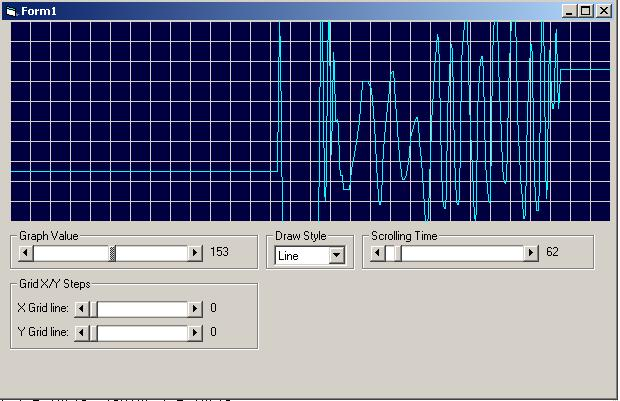

<div align="center">

## Scrolling Graph


</div>

### Description

Nothing special, just a scrolling graph. I just wanted to see if I could make one, and I did. I'm sure there are other ways of doing it, but this seems to work fine. Enjoy
 
### More Info
 


<span>             |<span>
---                |---
**Submitted On**   |2004-02-21 19:35:10
**By**             |[MJOsborn](https://github.com/Planet-Source-Code/PSCIndex/blob/master/ByAuthor/mjosborn.md)
**Level**          |Beginner
**User Rating**    |5.0 (25 globes from 5 users)
**Compatibility**  |VB 6\.0
**Category**       |[Graphics](https://github.com/Planet-Source-Code/PSCIndex/blob/master/ByCategory/graphics__1-46.md)
**World**          |[Visual Basic](https://github.com/Planet-Source-Code/PSCIndex/blob/master/ByWorld/visual-basic.md)
**Archive File**   |[Scrolling\_1711742212004\.zip](https://github.com/Planet-Source-Code/mjosborn-scrolling-graph__1-51926/archive/master.zip)

### API Declarations

```
Private Declare Function SetPixelV Lib "gdi32" (ByVal hdc As Long, ByVal X As Long, ByVal Y As Long, ByVal crColor As Long) As Long
Private Declare Function LineTo Lib "gdi32" (ByVal hdc As Long, ByVal X As Long, ByVal Y As Long) As Long
Private Declare Function MoveToEx Lib "gdi32" (ByVal hdc As Long, ByVal X As Long, ByVal Y As Long, lpPoint As POINTAPI) As Long
```


